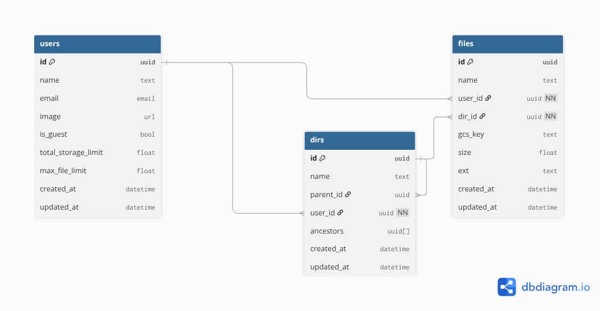
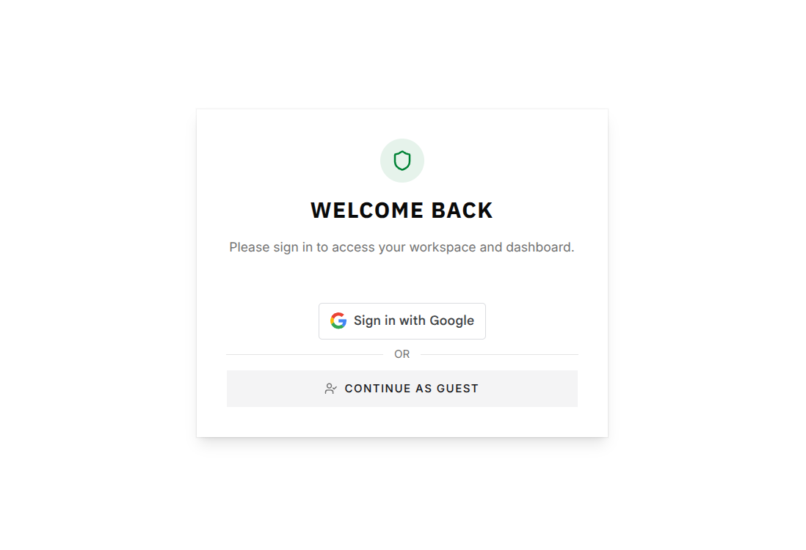
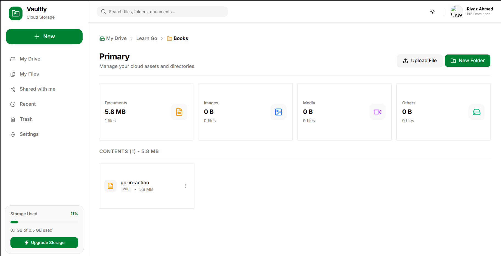
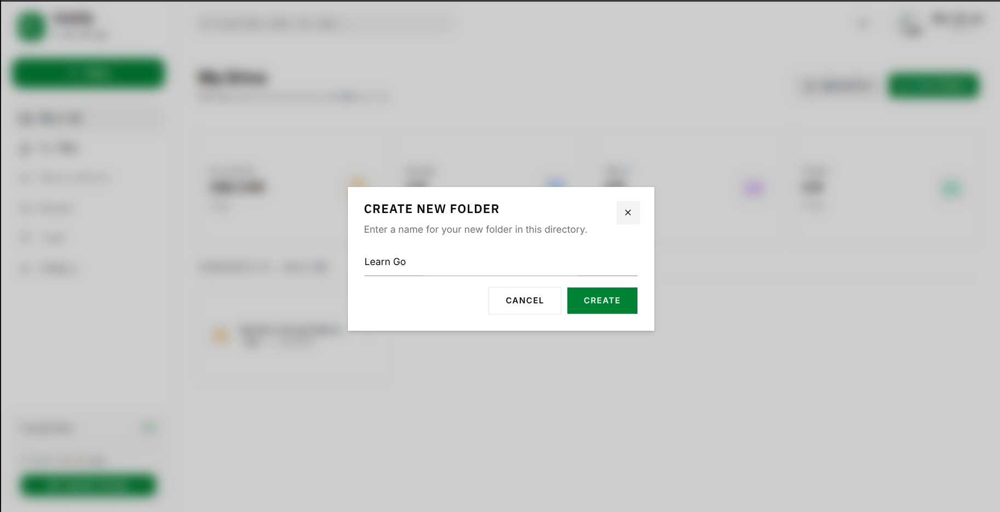
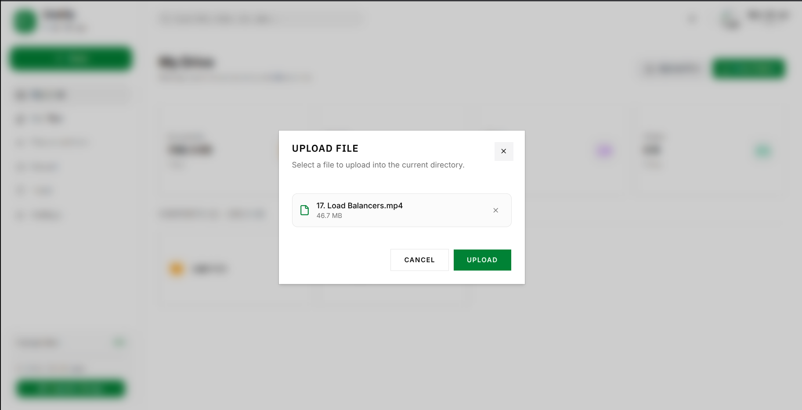
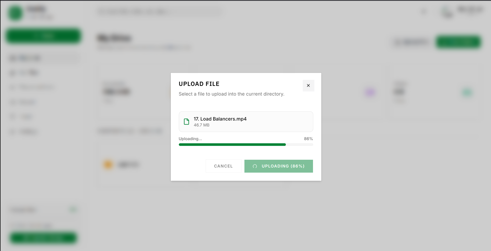

# VAULTLY — A Cloud Storage Application

Vaultly is a full-stack cloud storage application built with **Go** on the backend and **React** on the frontend. It gives users a virtual file system to manage files and directories, using Google Cloud Storage (GCS) for blob storage and PostgreSQL for metadata.

---

## Tech Stack

- **Language:** Go
- **Web Framework:** Echo
- **Primary DB:** PostgreSQL
- **Object Storage:** Google Cloud Storage (via a dedicated, least-privilege service account)
- **Auth:** Google Identity Services (client-side ID token flow) + self-issued JWT sessions + Guest login
- **Migration Tool:** Tern
- **Frontend:** React + TypeScript + TailwindCSS

---

## 📁 Directory Structure

```
.
├── cmd/                      # Application entrypoint
├── internal/
│   ├── config/               # Env loading + struct validation at boot
│   ├── database/              
│   |    └── migrations/      # Tern migration files
│   ├── model/                # Domain structs (Dir, File, User) 
│   ├── handler/              # HTTP layer — binds, validates, delegates to services
│   ├── service/              # Business logic — ownership checks, compensating transactions
│   ├── repository/           # Raw SQL — no business logic, just data access
│   ├── router/             
|       ├── v1/
|           ├── main.go       # API v1 router setup
|           ├── user.go       # API v1 user routes
|           ├── dir.go        # API v1 directory routes
|           ├── file.go       # API v1 file routes
|       ├── router.go         # Centralized echo router setup
│   ├── errs/                 # Typed application errors (AppErr) for consistent HTTP mapping
│   └── middleware/           # Auth middleware, global error handler
├── lib/
│   └── gcs/                  # GCS client wrapper: Upload/Delete/SignedURL, isolated from services
              

```

---

## Database Architecture & Schema Design

The database schema is designed in PostgreSQL with a strong focus on **relational integrity**, **cascade-safe deletes**, and **hierarchical data modeling** for nested directories.



---

### Key Entities & Relational Rules

- `users` — Google-authenticated or guest accounts. Guests get reduced quota (`max_storage_limit`, `max_file_limit` set explicitly at signup, not inherited from a default).
- `dirs` — self-referencing hierarchy (`parent_id → dirs.id`, `ON DELETE CASCADE`) plus a denormalized `ancestors UUID[]` column.
- `files` — belongs to a `dir` and a `user`, stores GCS object `key`, `size`, `content_type`.

**Why `ancestors UUID[]` and not a stored path with names:**
I only store the ancestor **IDs**, not their names. If I stored names, renaming a folder would mean updating every single descendant's stored path — that gets expensive fast for something as common as a rename. With just IDs, a rename is a one-row update. The trade-off is that showing a breadcrumb needs one extra query to fetch the names — but that's a small cost.

**Constraints:**
- `dirs.parent_id` and `files.dir_id` → `ON DELETE CASCADE` (deleting a directory cascades DB-side)
- Unique constraint on file `key` (GCS object path is never reused)
- Recursive CTEs (not application-level tree walks) compute directory size and gather nested file keys — the query scales with tree depth, not with round-trips

---

## Overview of Frontend
The frontend is a React application built with TypeScript and styled using TailwindCSS. It provides a user-friendly interface for managing files and directories, including features such as:
- Drag-and-drop file uploads
- Directory navigation with breadcrumb trails
- File previews and downloads via signed URLs

---
### Authpage


### Dashboard


### New Folder


### Upload File



## Core System Architecture & Engineering Decisions

### Key Engineering Decisions

**GCS + Postgres consistency** — Since there's no shared transaction between GCS and Postgres, uploads and deletes follow an ordered sequence with manual rollback on failure (a lightweight Saga).

**Signed URLs, not server-proxied files** — The `Serve` endpoint returns a short-lived (15 min) V4 signed URL and redirects to it, so files are served directly by GCS, not streamed through my backend. A `disposition` param (`inline`/`attachment`) controls preview vs download.

**Concurrent directory reads** — A directory's metadata, size, and breadcrumb are three independent queries, so they run in parallel with `sync.WaitGroup` instead of one after another.

**Least-privilege storage access** — The backend uses a dedicated service account scoped to a single bucket (`roles/storage.objectAdmin`, bucket-level not project-level), not my personal GCP identity.

**Client-side Google auth** — The frontend gets a signed ID token directly from Google; the backend just verifies it against Google's public keys and issues its own JWT session. No server-side OAuth redirect, no client secret involved in this flow.
---

## Local Setup

```bash
# Prerequisites: Go, PostgreSQL, gcloud CLI, a GCP project with a GCS bucket + service account key

# 1. Install dependencies
go mod tidy

# 2. Configure environment
cp .env.example .env
# fill in DATABASE_URL, GOOGLE_CLIENT_ID, GOOGLE_APPLICATION_CREDENTIALS, GCS_BUCKET_NAME, JWT_SECRET

# 3. Run migrations
task migrations:up

# 4. Run the server
go run cmd/main.go
```

---

## Status - under active development
